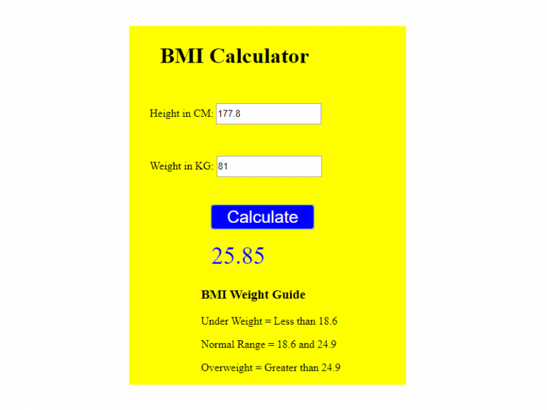

# BMI Calculator

# What You Should See
Visit the hosted github page to see this [BMI Calculator]() in action.

# Project Objective
The objective of this JavaScript project is to wire up a very basic JavaScript BMI Calculator.

# JavaScript Used
* JavaScript conditionals
* JavaScript addEventListener property
* JavaScript CSS selectors

# Project description
The calculator requires just two inputs, your height in centimeters and your weight in kilograms. Once you give the two values to your calculator and click the calculate button (or press enter) you'll get a BMI readout. 
